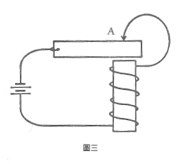

# 十三、邏輯是因果顺序的不良模型

我們使用同樣的語詞來談邏輯順序和因果順序。我們說:「**若**我們接受歐幾里德的定義和公設,**則**三邊相等的兩個三角形是全等的。」我們又說:「**若**溫度低於攝氏零度以下,**則**水就會開始結冰。」

可是邏輯三段論中的**若...則...**。日,和因果關係中的**若...則...**有很大的差別。 

電腦是藉由因果關係運作的,一個電晶體啟動另一個電晶體,這些因果順序被用來**模擬**邏輯。三十年前我們曾問道:「電腦能夠模擬**一切**邏輯程序嗎?」這個問題的答案是肯定的。不過這個問題本身卻錯了。其實我們該問的是:「邏輯能夠模擬一切因果順序嗎?」答案是否定的。

當因果順序變為循環性質(或更複雜)時,若把對此循環順序的描述套在不具時間性的邏輯規則上,就會自相矛盾。純粹的邏輯無法與用詭並存。普通的蜂鳴器電路就是一個例子。生物學中俯拾皆是的百萬個內穩態實例,都是顯而易見的邏輯用詭。蜂鳴器電路的裝置是這樣的(見圖三):當線圈與電極棒在A點接觸時,電流就會通過整個電路。但是電流會啟動繞有線圈的電磁鐵,而A點的線圈就會被拉開。如此電流會被切斷,電磁鐵停止反應,而線圈又會回到A點,然後一再重複這個循環。



倘若我們以因果順序來分析這個循環,就會得到以下陳述:
```
若線圈觸及A點,則磁鐵就會產生反應。
若磁鐵產生反應,見於點上的接觸就會被阻斷。
若A點上的接觸被阻斷,則磁鐵就會停止反應。 
若磁鐵停止反應,則線圈會觸及A點。
```

當我們清楚知道,上述的「若...則...」是**因果**的連接,這個順序就完全令人滿意。但一到邏輯的世界,這糟糕的雙關語就會變成災難:
```
若線圈觸及A點,則A點上的接觸就會被阻新。
若P,則非P。
```

因果關係中的**若...則...** 包含了**時間**,但邏輯中的**若...則...** 是不具時間性的。由此推之,邏輯是因果關係不完整的模型。