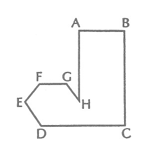
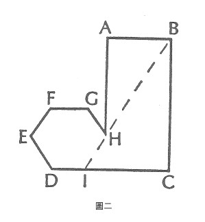

# 五、將知覺到的宇宙分為部分和整體是權宜之計,或許也是必要的,但並沒有必然性來決定分割的方式[^6]

[^6]: 這裡所提到的形式必然性問題,有一個可能的答案:很明顯的,宇宙的各個部分是由因果和其他連結類型的不均匀分布所連接起來的。也就是說,連結密集的區域之間,是被連結較疏鬆的區域所分開。其中也許存在著必要且不可免的過程,這些過程反應了交互連結的密度,是以密度或稀疏度會相對增大。在這種情形,宇宙必然會呈現出整體被交互連結的相對稀疏度所限定的景象。

我多次試著把這項普遍原則教給班上的學生,為了便於教學,我以圖一來作示範。我用粉筆把這個圖形精確地畫在黑板上,但是上面並沒有字母來標註不同的角。我要求學生寫一頁的英文報告來描述「它」。當每個學生都完成了自己的描述時,我們就開始比較結果。這些結果可分成幾類。

1. 例如,大約不到百分之十的學生說,這東西是一隻靴子,或更生動地說,這是腳趾風的人所穿的靴子,甚至也有人說這是馬桶。很明顯的,對聽到這個描述的人來說,要根據這種類比或圖像式的描述再畫出這個圖形,會很困難。
2. 更多的學生將它看成是一個矩形和一個六角形的組合,並以這種方式將它分割。然後描述這不完整的矩形和六角形之間的關係。其中有少數的學生(但令人意外的,每班通常只有一兩個)會畫出BH這條線,並將它延伸至與底線DC交叉的位置,即I點,是以HI這條線就會連成一個完整的六角形(見圖二)。這條想像的線會定出矩形的比例,而不是矩形的絕對邊長。我通常會恭喜這些學生,因為他們擁有類似於創造科學假設的能力;也就是以某種想像出來的事物,「解釋」一個可被知覺的規律。

3. 許多受過訓練的學生會訴諸於操作性的描述法。他們會從圖形輪廓上的某一點開始(有趣的是,總是從某個角開始),然後通常以順時鐘的方向來標示所畫的圖形。
4. 還有兩種其他廣為人知的描述法,至今未曾有學生使用過。沒有學生從「它是粉筆和黑板所作成的東西」這句話開始描述。也沒有學生使用方格法,把黑板分成格子,並以「有」或「沒有」來表示格子中是否包含了所畫的東西。當然,如果格子畫得太大而東西太小,大量訊息會因此流失。(想像整個東西比一個方格單位還要小。根據方格中的區塊落在所繪物件上的情形,此描述會包含一至四個肯定命題。)然而,原則上來說,這就是黑白報紙藉由電流傳輸的方式,實際上電視也是如此運作的。

所有這些方法,都沒有**解釋**黑板上的東西---那個六角加矩形。解釋必定源自於描述,然而,就像這裡的幾個例子一樣,描述必定帶有任意的特性。 
