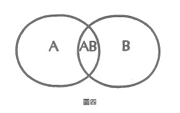

# 案例二 雙眼視覺

讓我們舉另一個關於雙重描述的簡例。藉著比較兩隻眼睛所收集到的資料,我們得到了什麼?一般來說,雙眼所見的是同一個視域,看來似乎是浪費了感覺器官的力氣。但是解剖學指出,使用雙眼有相當多的好處。視網膜的神經分布,以及重新分配訊息的視神經交叉是如此巧妙,因此它們必定提供了極大的進化優勢。

簡言之,水晶體將所見之物的倒像,聚焦於近乎半球體的視網膜表面。於是左方物體的映像,會被投射在右眼網膜外側及左眼網膜內側。令人驚訝的是,單眼網膜的神經分布,被一明確的垂直界線分成兩個系統。因此,視神經纖維從右眼外側所傳送的訊息,與視神經纖維從左眼內側所傳送的訊息,會在右腦交集。同樣的,從左眼網膜外側傳送的訊息,會和右眼網膜內側傳送的訊息聚集在左腦。

表面上看來未受分隔的雙眼視像,實際上是由右腦左側所得的訊息,加上左腦右側所得的對應訊息複合而成。這兩個經過合成的訊息,再被綜合為一個單一的主體視像,而那條垂直的分界線早已消失無蹤。

這精緻的安排累積了兩種優勢。它使觀看者能夠加強截面和對比的解析度,對小型字體或在光線黯淡的地方看得較清楚。更重要的是,深度的訊息因此產生了。用較正式的語言來說,雙眼視網膜所提供的訊息之差異,構成另一個**不同邏輯類型**的訊息。此新類型的訊息,使觀看者的視覺多了額外的**維度**。

在圖四中,A代表從第一個來源(例如右眼)所得的一類訊息成分,B代表從第二個來源(例如左眼)所得的一類訊息成分。而AB則代表雙眼所提供的另一類訊息成分。A中若不是包含成員,就是空的。

如果AB中有真正的成員,就表示B中的訊息,已經在A中劃出一個次類別,而這個次類別是A所無法獨力建立的(也就是說,B與人的交集,產生了一個A所無法自生的訊息邏輯類型)。

根據此一通則,我們現在去找其他的案例,特別要注意的是,在這些案例中,新邏輯類型訊息的產生,是將各種描述並置在一起所導致的。原則上,那多出來的「深度」,就隱喻的意義而言,源自於以不同方式收集或編碼得來的兩種描述。

