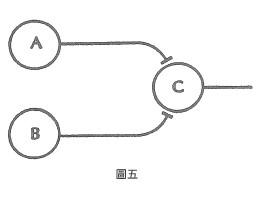

# 案例四 突觸的加成作用

突觸的加成作用 (Synaptic Summation)是神經物理學的術語,用來指涉只有在神經元A與B同時刺激下,神經元C才會活化的現象。只有A或B單獨一個神經元的刺激是不足以活化C的,但如果A和B在限定範圍的微秒內一同發出刺激,就會引發C的衝動(見圖五)。描述此現象的傳統用語加成,意謂著它將某個來源訊息加到另一個來源訊息上。可是實際上所發生的事,並非單純的加法,而是一種邏輯產物,一種更接近乘法的過程。

神經元A所單獨釋出的訊息,是將它發出的刺激分成兩類,一為隨同B一道發出的刺激,二為無B隨同的刺激。同樣的,神經元B發出的刺激也可分為兩種,即隨同A發出的刺激,與無A隨同的刺激。
