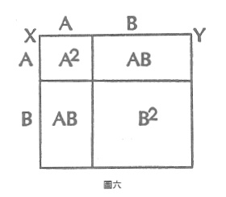
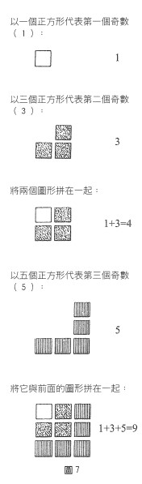

# 案例六 同義語言

在許多情況下,洞察力的增加來自於第二種描述的語言,而其中並未加入任何所謂的客觀資訊。將一個數學定理的兩個證明結合起來,可以使學生對於所示範的關係有額外的領悟。

每個孩子都知道 $(a+b)^2=a^2+2ab+b^2$ ,而他可能也知道,這個代數方程式是進入**二項式定理**之龐大數學領域的第一步。這個式子可由代數相乘的計算來證明,而每個步驟都符合被稱為代數的套套邏輯中的定義和假設---一種旨在於展開與分析「任何」這個概念的套套邏輯。

但是很多孩子並不知道,同樣的二項式展開也有幾何上的證明(見圖六)。作一直線XY,並將這條線分成a和b兩個部分。現在這條直線就代表了幾何學上的 $(a+b)$ ,而由XY所構成的正方形面積是 $(a+b)^2$ ;也就是說,我們畫出一塊叫作「 $(a+b)^2$ 」的區域。



在直線XY上標出a的長度,並在與之相鄰的垂直邊作同樣的記號,再根據這兩個記號;畫出與正方形邊長平行的直線,便可切割這個正方形。孩子此時會認為,這個正方形被分為四塊。兩個正方形,其中一個是 $a^2$ ,另一個是 $b^2$,以及兩個 $(a \times b)$ 的矩形(也就是2ab)。

因此,我們所熟悉的代數方程式 $(a+b)^2+2ab+b^2$ ,看來在歐幾里德幾何學也為真。只不過我們不能冀望 $a^2+2ab+b^2$ 中分開的各個項目,在幾何的轉譯下,仍會以同樣的方式分項。

但是,我剛才到底說了些什麼?我們憑什麼以一種所謂的「長度」來代替a,用另一種長度來代替b,並且以為把它們的端點連起來,就會是一條直線 $(a+b)$ 呢?我們能夠確定這些線條的長度一定會遵循數學規則嗎?我們用一種新的語言來重述同樣的事情,而孩子從中學到了什麼?

就某個意義而言,**什麼都沒學到**。我用幾何學和代數來聲明 $(a+b)^2=a^2+2ab+b^2$ 為真,並沒有生產或捕捉到任何新訊息。

那麼,像這樣的一種**語言**,並不包含訊息羅?即使就數學本身而言,這個數學戲法並未添加任何東西,但我還是相信沒見過這個戲法的孩子。在看到它的時候是有機會學到一些東西的。這是啟蒙式的教學法。發現(如果這是發現的話)兩種語言(代數和幾何學)是可以彼此轉譯的---這件事本身就是一種啟蒙。

另一個數學例子,也許能幫助讀者更了解使用兩種語言的效果。[^1]

問問你的朋友:「前十個奇數的總和是多少?」

答案可能會是他們不理你,或者他們會試著把這些數字加起來:

$1+3+5+7+9+11+13+15+17+19$

他們會這麼算:

```
第一個奇數的總和為1。
前兩個奇數的總和為4。
前三個奇數的總和為9。
前四個奇數的總和為16。
前五個奇數的總和為25。
以此類推。
```

很快的,你的朋友會說:「嗯。前十個奇數的總和一定是一百。」他們學會這將奇數加起來的**把戲**了。

但若你問,為什麼這個把戲**一定會**奏效,一般非數學家的人會無法回答。(而小學教育的狀況是:許多人根本不知該如何計算這個問題。)

人們需要知道的是**序數**和**基數**之間的差異---邏輯類型上的差異!我們慣於認為個數字的稱名,就等同於它的數值。[^2]但實際上,此例中的稱名,並非其所名之物。

前三個奇數的總和為9。也就是說,這個數列的總和是數列中最大數的**序數的平方**(以前三個奇數為例: $1+3+5=9$ ,而5的序數為第三,9即3的平方)。或者,如果你喜歡的話也可以說,其總和為數列中**數字之數目**的平方。這是字面上的把戲。

要證明這把戲為真,我們必須展現連額兩個奇數數列總和之差,**恆**等其序數平方之差。舉例來說,前五個奇數的總和**減掉**前四個奇數的總和,必定會等於 $5^2-4^2$ 。當然,同時我們也會注意到,這兩個總和之差,事實上就是此數列的最後一個奇數。換句話說,最後一個奇數必定會等於其序數平方之差。

這件事同樣可用視覺的語言來描述。我們必須證明數列中最後一個奇數加上前面所有奇數的總和,正好就是那個奇數的序數平方。



也就是, $4+5=9$ 。

以此類推。這種視覺的呈現,使我們比較容易將數列中的序數、基數及其總和的規律性整合起來。 

剛才所發生的事是---運用幾何學的隱喻系統,來幫助我們了解機械性的把戲**如何**變成一種規則或規律。更重要的是。學生藉此認識到玩把戲與了解把戲背後的必然真相之間的對比。比這還更重要的是,學生在無形中已經從「說算數語言」,跳躍到「談論算數語言」了。我們所談論的不是**數字**,而是**數字的數目**。

用華勒士。史蒂文斯(Wallace Stevens)[^3]的話來說,只有到了**那個時候**:

```
葡萄看來更鮮美。 
引誘狐狸出了洞。
```

[^1]: 拜亨德理克斯(Gertraude Hendrix)之賜,我才得知這多數人所不熟悉的規律性。Gertrude Hendrix, "Learning by Discovery" The Mathematics Teacher 54(May, 1961):290-299.
[^2]: 用另一種方式說,一個數列中數字的數目,並不等於數列中數字的總合。無論如何,我們遇到的是不連續的邏輯類型。
[^3]: 譯註:史蒂文斯(1879-1955),著名的美國詩人,主要詩集為《關於秩序的思想》(1935)、《貓頭鷹的三葉草》(1936)等。