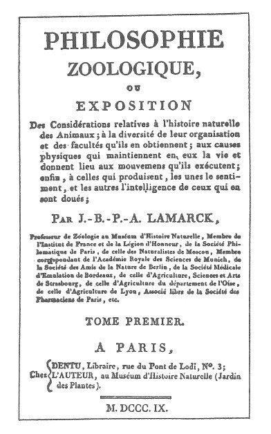

# 判準一 心智是產生互動的各部分或成分的集合

在許多例子中,這類集合的某些部分本身,可能就符合了所有的標準,在這種情況下,它們也可被當作是**心智**或**次心智**來看待。然而不變的是,當我們層層切割到較低的層次,並把這些部分拿來獨立考量時,它們總會缺乏符合心智標準的必要複雜性。

換句話說,在我設的標準下,我不相信單一的次原子粒子會是「心智」。我真正相信的是,心智過程永遠是各部分之的互次序·要解釋心智現象,必須著眼於各個部分的組織與互動。

對許多讀者而言,我似乎不必要如此堅持第一個標準。但這是件重要的事,即使只為駁斥相反的意見;比這更重要的是,我得說明我之所以無法容忍的原因。幾個頗受尊敬的思想家,特別是巴特勒---我從他那兒得到許多樂趣和洞見---還有近來的德日進(Teilhard de Chardin),他們所提出的進化理論認為,最小粒子的特性是某種精神的驅力。[^1]

在我看來,這些假設把超自然的東西從後門引進來。接受這個概念,對我而言如同 不戰而降。他們說宇宙中有無法解釋的動作複雜性,因為這些複雜性毋須依靠任何其他的複雜性而存在。沒有部分的分化,就沒有事件或功能的分化。我們在解析原子個體時,如果它自身內部不具分化性質,那麼複雜過程的出現,只能歸因於原子之間的交互作用。

又,設若原子內部具有分化性質,則它們在我的定義裡就**不算**原子,而且我還會預期,尚有更單純的、不具心智功能的實體會被發現。

最後---但只是最後的手段---如果德日進和巴特勒的假設是對的。即原子內部不具分化性質,卻仍具有精神的特性,那麼所有的解釋都是不可能的,而我們這些科學家就該捲鋪蓋回家釣魚了。

這整本書所依據的前提是:心智功能內存於分化「部分」之間的互動。「整體」是由這類結合起來的交互作用所形構的。

在這個主題上,我寧願跟從拉馬克的說法。他在為比較心理學建立學說基礎時,設定了這個原則:神經系統複雜度不足的生命體,不具有心智功能。[^2]

換句話說,這裡提出的心智理論是整體導向的,它和所有嚴肅的整體論一樣,把前提建立於各部分的分化與互動之上。

[^1]: 德日進(1881-1955),法國耶穌會神父、神學家、哲學家、地質學家、古生物學家,認為人類在不斷進化,最終將達到精神的統一。
[^2]: 《動物學的哲學》(1809),初版,特別要注意的是第一章第三部分。拉馬克的標題頁如圖所示,其翻譯如下:**動物學的哲學或對於動物自然史的相關闡述,包括動物〔內部的〕組織性及源自於那〔組織性〕的〔心智〕官能多樣性;以及維持生命、使動物能從事運動的生理原因;最後是具備那些〔官能〕的那些〔動物〕所生的知覺及智能的那些〔生理原因〕。**讀者會發現,即使只是標題頁,拉馬克仍謹慎地堅持用精確明瞭的方式,來陳述「生理原因」、「組織性」、「感知」及「智能」之間的關係。(要翻譯法文的**感知**和**智能**是件困難的事。我的解讀是,感知較接近使用英語系心理學家所說的「知覺」,而智能則近於我們所說的「智力」。)