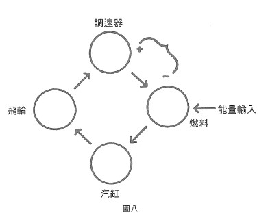

# 判準四 心智過程必須具備作決定的循環(或更複雜的)鏈

如果只為了存在、延續下去,那麼像花崗岩這類堅硬的岩石,就是肉眼可見的事物中數一數二的模範了。打從地殼形成以來,花崗岩的特性就沒變過,從南北極到熱帶的不同地形,都遍布它們的蹤跡。如果天擇說的單純套套邏輯是這樣:「那些歷時最久仍為真的描述命題,比其他較快變為非真的命題,更恆久為真」,那麼花崗岩就比任何生命都成功了。

但岩石的方式是不同於生命體的。我們可以說,岩石**抗拒**變化;它靜止不變。而生命體是藉著修正變化,或改變自己以適應變化,或將持續的變化納入自己的存在來逃避變化。「穩定」的達成,若不是藉由守恆的嚴謹性,就是藉著較小變化的不斷重複循環,在每次擾動後重新回到變化前的狀態。自然界的事物,藉著接受一時的變化,來規 避(暫時性的避免)永久的變化。日本人的比喻是:「竹子迎風彎腰」,藉由從個體轉到族群的方式來規避死亡。用人格化的方式來說,自然系統以生命個體代替抽象的實體(類別),允許死亡這老頭(也被人格化了)獵取個別的受害者。,而死亡的動作必須比生物的繁殖速度更快。最後,如果死亡戰勝了物種,自然便會說:「這正是我的生態系統需要的。」

只有將前三項判準與第四項判準整合起來,生命特有的求存方式才可能達成。

在第二次世界大戰末期,由於諾伯特。維納(Norbert Wiener)和其他工程師對無生命系統(機器)的研究,使得循環因果律的觀念取得非常重要的地位。[^8]我們可用高度簡化的機器圖表,來詳加說明這個觀念(見圖八)。

想像一台由四個部分所組成的機器,我們姑且稱這四組件為「飛輪」、「調速器」、「燃料」及「汽缸」。除此之外,這台機器以兩種方式與外界連結起來:「能量輸入」及「負載量」。,它們必須被當成是變量,也許是飛輪的載重。這台機器是循環性的---飛輪帶動調速器,調速器改變燃料供輸,燃料供應能量給汽缸運作,而汽缸又使飛輪轉動。

因為這是個循環系統,在迴路中任一點所發生的事件之效應會擴散開來,而在起源點上產生改變。

在這個圖表中,箭頭代表從原因到效應的方向,我們也可以想像,從一個步驟到另一個步驟之間,任何因果關係類型的組合都有可能。這些箭頭可以被當作數學函數或方程式的代表符號,用以說明接續組件彼此間的**效應類型**。因此,調速器雙臂的角度,就代表飛輪角速度的函數。

在最單純的個案中,組件與組件之間的箭頭。不是代表**無增益**,就是代表**正增益**。在本例中,調速器以工程師所不允許的方式,連結到燃料供輸的組件,也就是說,調速器懸臂又開越大,供應的燃料就越多。這樣的裝置會使機器**失控**---它的運轉持續急劇加快,直到組件壞了,或油管無法再增加供油為止。 

不過,此系統中也可設定一個或多個反向關係。這就是調速器通常的設定方式,在本例中,調速器懸臂叉開越大,供應的燃料就越少。

就歷史而言,正增益的系統從很久以前就被稱為**逐步加劇**或**惡性**循環。我在新幾內亞的雪碧克河研究伊阿母部落文化時,發現團體和親族中各種不同類型的關係,都具有行為交換的特性---A表現出越多的某一行為,B就越可能做出相同的行為。我稱之為**對稱的**互換。相反的,另一種典型的互換是:B的行為雖與A不同,但卻可與之**互補**。不論是哪一類,這些逐步加劇的關係,我稱之為**分裂相生**。

當時我注意到,對稱和互補的分裂起源,理應導向系統的失控與停擺。每次互換所產生的正增益,及人類新陳代謝提供的充分能量,在憤怒、貪婪或羞恥中,毀滅了這個系統。只需少許的能量( $ MV^2 $ ),就足以使一個人毀滅其他人,或是破壞一個社會的凝聚力。

換句話說,一九三0年代時,我對「失控」這個觀念就很熟悉了。我分析這些現 象,甚至推敲不同類型的失控,可能會有什麼樣的組合。不過,當時我沒想到因果循環可能就在其中,此循環會包含一或多個負環節,而且可能因此具有自行修正的功能。當然。那時我也沒想到,諸如人口過度成長這類的失控系統,可能本身就帶有自行修正的種子,它以傳染病、戰爭及政府政策的形式表現出來。

許多自行修正系統已廣為人知。可是,已知的都是個別案例,其原則仍是未知。實際上,西方人不斷發現個例。卻無法察覺其中隱含的原則,這顯示出西方知識論的圍硬。這些不斷發現的原則,包括拉馬克的進化論、瓦特(Jaines Watt)在十八世紀末所發明的蒸汽機調速器、華雷斯在一八五六年所察覺的自然淘汰、馬克士威(Clark Maxwell)在一八六八年對蒸汽機調速器的數學分析、貝爾納的內穩態、黑格爾和馬克思對社會過程的分析、坎農(Walter Cannon)的《身體的智慧》(Wisdom of the Body),以及二次世界大戰和戰後,發展控制論和系統理論所採取的各個獨立步驟。

到了最後,羅森布魯(Rosenblueth)、維納和比格羅(Bigelow)在《科學哲學》(Philosoplay of Science)期刊共同發表了一篇著名的論文,提出自行修正迴路及其多種變體,為我們帶來構建生物適應行為的可能性。[^9]但希臘哲學的中心問題---關於目的的問題,兩千五百年來一直未有定論---也在他們嚴謹的分析範圍內。他們甚至可以模擬貓跳躍的過程,算出牠著地的時間點和此時間點上老鼠的位置。

然而,在此我要提出一個值得思考的問題:認知到控制論的基本原理之所以如此困難,是否只是因為人類懶得對他們的思想典範作根本的改變,還是有其他的過程,使當時的人無法接受那些我們現在看來非常簡單的觀念?舊時的知識論,是被它自行修正的迴路所強化,亦或被失控的迴路所強化?

詳加說明十九世紀蒸汽機調速器的歷史,也許能幫助讀者了解這些迴路,以及其發明者的盲點。在為早期的蒸汽機加裝上控制速度的調速器時,工程師們遇到了困難。他們去請教馬克士威,抱怨他們無法畫出有調速器的蒸汽機圖·他們沒有理論基礎可以預測自己畫出來的機器會如何運作。

機器的運轉有以下幾種可能:第一,機器失去控制,一下子將速度增到最大,直到壞掉,或是漸漸慢到停下來為止。或是,機器搖擺不定,根本就無法在平均值上安定下來。其他的可能更糟連擺動幅度都起伏不定,或是越搖越厲害。

馬克士威檢視了這個問題。他針對迴路中每個接續步驟的變量之間的關係。寫出一套方程式。像那些工程師一樣,他發現,光是將這套程式組合起來並不能解決問題。最後他終於領悟到,工程師所犯的錯誤,在於沒有把**時間**納入考量。每個系統體現出它與時間的關係,也就是說,**整體**所決定的時間常數標示出系統的特性。這些常數並非由相接組件的關係方程式所決定,它是整個系統**逐漸顯露**的性質。

現在我們來想像一下,當引擎平順運作時,遇到了一個負載---它要上坡或是負載某些裝置。飛輪的角速度立刻降下來,使得調速器的轉動也慢了下來。調速器的懸臂往下掉,使懸臂和傳動軸之間的角度減小。當這個角度減小時,更多燃料就會注入汽缸中,而機器就會加速,與剛遇到負荷時的改變相反,飛輪的角速度增加了。

不過,修正性的改變,是否會精準地抵銷承受負載所帶來的改變,這是個難度頗高的問題。畢竟,整個過程發生於時間之中。在時間點1上,引擎遇到了負載。在時間點1後,飛輪的速度改變了。接著調速器也跟著改變。最後,修正的訊息在時間點2傳到了飛輪,此時間點1要來得晚。但是,修正的量取決於時間點的偏差量。到了時間點2時,偏差量已經改變了。

在我們對這些事件的描述中,發生了一個有趣的現象。我們在講它的時候,就好像我們身處於這套迴路之中,注意到組件動作的改變,是由迴路中各個組成物之間的力和衝擊所決定的。一步步繞著迴路,我的描述也產生了規律的形式:在A中所發生的改變,決定了B的改變,以此類推。可是當描述回到了它的起點,句法就突然改變了。現在我們的描述必須去比較兩種改變,並且用比較**之後**的結果,來說明下一個步驟。

換句話說,我們論述的主題已經起了微妙的變化。如本章最後一節(判準六)所言,我們應把它稱作**邏輯分類**的改變。就像物理學家描述某變量如何影響其他變量所使用的語言,不同於說明整個迴路減少或增加差異時所用的語言·當我們說,這個系統顯示出「穩定狀態」(即使有變化,仍維持一個平均值),我們談的是整個迴路,而不是其中的變化。同樣的,工程師們問馬克士威的問題,是關於整個迴路的問題。我們如何能讓它達到穩定狀態?他們以為答案存在於獨立變量之間的關係。而馬克士威所提供的答案,就是根據整個迴路的時間常數而算出來的。它銜接了兩個不同層次的論述。

在某個論述層次中,被搬上舞台的事物和變量,到了較高或較低的層次中就退到了幕後。為了便於說明,我們就來思考一下**開關**此詞所指涉的事物,有時工程師會叫它作**閘門**或**繼電器**。通過閘門之事物的能量來源,不同於開啟閘門的能量來源。

在我們的第一印象中。「開關」是安裝在牆上控制電燈開關的裝置。更咬文嚼字的說法是,人類透過手「使用」開關,把燈打開或關掉。

我們並沒有注意到,「開關」這個概念和「石頭」、「桌子」之類的概念很不一樣。仔細審視,當開關處於「開」的位置上時,在電路上它其實是**不存在**的。從電路的觀點來看,開關和通往它的電線及牽離它的電線,並沒有什麼兩樣。它只是「導體的一部分」。相反的,當開關處在「關」的位置時,從電路的觀點來看,它也是不存在的。它什麼都不是---兩個導體之間的間隔,只有當電源開啟時才成為導體。

換句話說,只有在開關轉換的那一刻,它才是**存在的**。因此,「開關」這個概念和**時間**有一種特殊的關係。它關係到「改變」的概念,而非「物體」的概念。

如前所述。感覺器官只接收差異的訊息。實際上,通常也只有變化才能引發它們的反應。所謂的變化就是指事件,或是在被感知的世界中能藉著運動感官而化為事件的各種差異。換句話說,感官末梢就如同開關一樣,必須經由外界的影響,在某一刻被「打開」。而傳入的神經就在這一刻產生一次神經衝動。當然,它的閥值(啟動開關所需的事件量)是另一回事,而且會隨著物理環境的不同而變動,包括鄰近的感官未梢狀態。

事情的真相是,在整個生物學、生理學、思考、神經傳導過程、體內平衡、生態和文化系統中的這類因果循環,都隱藏著或顯示出那些伴隨著誤解或曲解邏輯類型而來的弔詭与混淆。這個主題與路系統和編碼(判準五)關係密切我們在第六節中,會對此作更多的討論。

[^8]: 譯註:維納(18941964),美國數學家、美國科學院院士。一九四八年發表名著《控制論,或關於在動物和機器中控制與 通信的科學》,成為控制論的創始人。
[^9]: A. Rosenblueth, N. Wiener, and J. Bigelow, "Behavior, Purpose and Teleology," Philosophy of Science 10 (1943): 18-24.